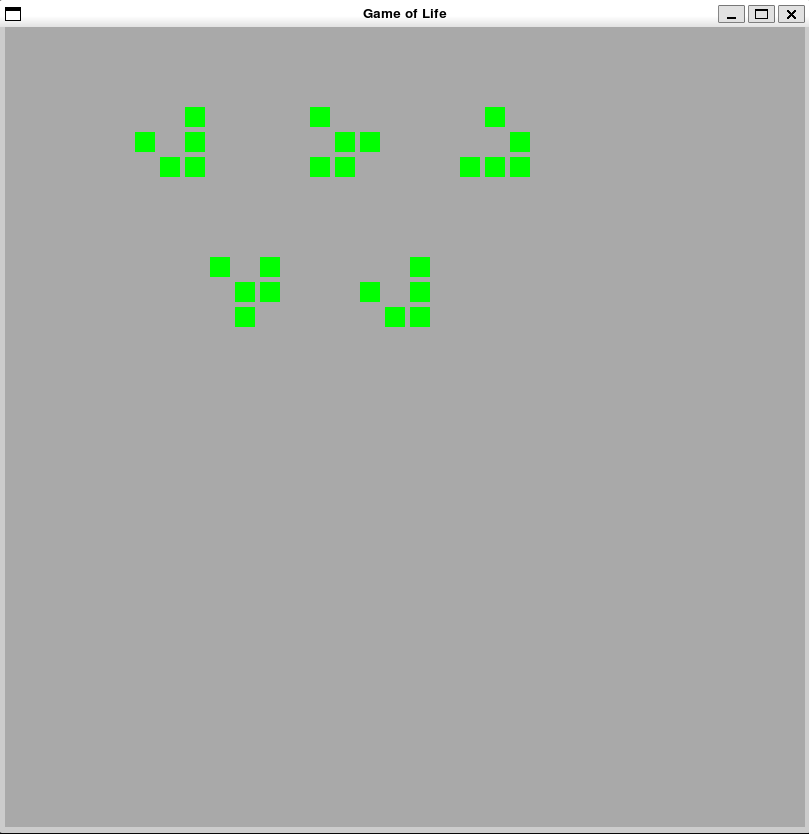
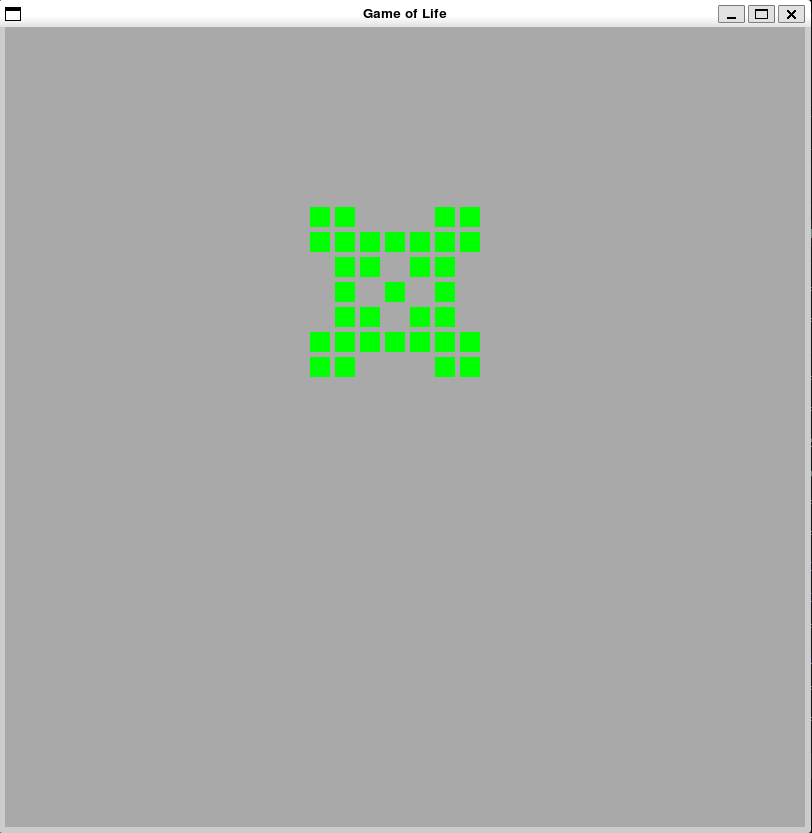

# Conway's game of life
The Game of Life is a cellular automaton developed by British mathematician John Horton Conway in 1970. 
It is the best known example of a cellular automaton. 
The game was created in order to reproduce, through simple rules, the alterations and changes in groups of living beings, having applications in several areas of science.

## Rules
- Any living cell with fewer than two living neighbors dies of loneliness. 
- Any living cell with more than three living neighbors dies from overpopulation.  
- Any dead cell with exactly three living neighbors becomes a living cell. 
- Any living cell with two or three living neighbors remains in the same state for the next generation.

### Instalation and controls
```
pip3 install -r requirements.txt
```
- r - Run (starts the animation)
- s - Stop (stops the animation)
- c - Clear (reset/clear the grid)



